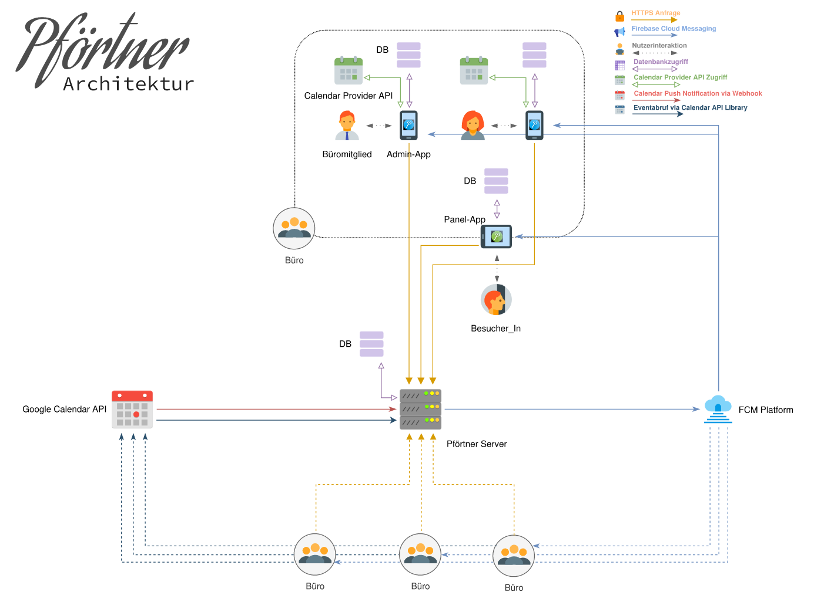

# Pförtner - The digital door label

<p align="center">
  
</p>

Pförtner is a fully digital door label.
* It utilizes a tablet outside an office room to display information about the office occupants.
The occupants inside the office can control the door label via a smartphone app.

* Each occupant can display their current status and their office hours along with a picture.

* A status for the whole room can be set along with a name for the room.

* Additionally, Pförtner utilizes the tablets' camera from the smartphone application to take a peek at who is outside the door.

* People outside the office can use Pförtner to arrange appointments. The selected occupant will get a notification on their smartphone and should the occupant accept the appointment, it will be added to their Google calendar. The creator of the appointments is notified via email.

<p align="center">
  <a href="https://youtu.be/asGR4Xj08gg">
    Watch a trailer here.
  </a>
</p>


## Architecture

The following picture shows the communication between the different components of Pförtner.
<p align="center">
  
</p>


For a detailed overview of Pförtners architecture take a look at the [technical documentation](Pfoertner-Technische_Dokumentation.pdf).

## System Requirements

* At least 2 Android devices with Android 8.0 or higher.
* The recommended configuration is 1 tablet as the door label and 1 smartphone per person working in the office.

## Setup instructions

Android studio needs to create the .apks for the clients from their corresponding projects:<br>
[PfoertnerAdmin](PfoertnerAdmin/) for the smartphone and [PfoertnerPanel](PfoertnerPanel/) for the table\label.

Both clients need the address where the server is hosted before the .apks are created.
For this, [Config.java](PfoertnerCommon/src/main/java/de/tu_darmstadt/epool/pfoertner/common/Config.java) needs to be edited.

The [server](PfoertnerServer) is deployed via docker.
First follow the instructions in this section to set up all config files, then build the docker image.
The server needs to either be accessible from the internet or all devices need to be on the same network.

### Step 0: Private clone / fork

To build your own instance of the Pfoertner service, we will need to add a few
secret files to this project in the following steps.

Hence, you should first make sure, your downstream clone/fork of this repository
is private.

### Step 1: Setting up Firebase for the PfoertnerAdmin app

This guide follows https://firebase.google.com/docs/android/setup#console

1. Create a Firebase project at https://console.firebase.google.com/
   You will need a Google account for this.

2. Open your project.

3. Register the admin app. For this, click on the Android icon.

4. Enter the following package name: `de.tu_darmstadt.epool.pfoertneradmin`

5. Enter some app nickname. E.g. `PfoertnerAdmin`

6. Download the `google-services.json` file offered to you. Place it at the
   following path in your clone of the project:

   `PfoertnerAdmin/app/`

### Step 2: Setting up Firebase for the PfoertnerPanel app

We will now repeat the above steps with minor changes to setup the PfortnerPanel
app:

1. Create a Firebase project at https://console.firebase.google.com/

2. Open your project.

3. Register the panel app. For this, click on the Android icon.

4. Enter the following package name: `de.tu_darmstadt.epool.pfoertnerpanel`

5. Enter some app nickname. E.g. `PfoertnerPanel`

6. Download the `google-services.json` file offered to you. Place it at the
   following path in your clone of the project:

   `PfoertnerPanel/app/`

### Step 3: Download Firebase Server Secrets

The backend server of Pfoertner needs a private key to access the Firebase
project. In this step, we will create it and provide it to the backend.

We will roughly follow the steps described here:
https://firebase.google.com/docs/admin/setup#initialize-sdk

1. Go to
   https://console.firebase.google.com/project/_/settings/serviceaccounts/adminsdk
   and open the Pfoertner project.

2. Generate a new private key in the displayed dialog.
   Download the file and save it as
   `PfoertnerServer/firebase/firebase-secret.json`

### Step 5: Setting up Google Calendar access

This section roughly follows https://developers.google.com/workspace/guides/create-credentials

1. Create a Google Cloud Console project:
   Go to https://console.cloud.google.com/projectcreate and enter a project name

2. Set up your project:
   * Go to https://console.cloud.google.com/auth/clients
   * Click "Get Started"
   * Enter an app name and email
   * Under audience you can select external, creating a Google Workspace is not required
   
3. Create a client (i.e. credentials to authenticate the server as belonging to the project)
   * Go to **Clients** in the side navigation panel and click **CREATE CLIENT**
   * Select **Web application** under **Application type**
   * You don't need to add any JavaScript origins or redirect URIs
   
4. Download the client secret
   * You will be redirected back to **Clients**
   * There you will see the web client you just created. On the right of the page under actions, click the download button (**Download OAuth client**)
   * Move the file you downloaded to `./PfoertnerServer/client_secret.json`
   
5. Copy the client id into the apps
   * Now click on the name of the client you have created
   * On the right side, under **Additional Information**, copy the **Client ID** ending in apps.googleusercontent.com
   * Open the file `./PfoertnerCommon/src/main/java/de/tu_darmstadt/epool/pfoertner/common/Config.java` and change the variable `SERVER_CLIENT_ID` to your client id

### Step 5: Setting up the backend server

1. Configure the public-facing URL of your backend in `./PfoertnerServer/.env`.

   E.g.
   ```
   PUBLIC_URL="https://myserver.de"
   ```

   This config example assumes a (reverse) proxy is in place which applies SSL
   encryption and binds to port 443.

   If you do not want to setup a Apache or nginx (reverse) proxy to apply
   encryption (**strongly discouraged!**), you can configure the URL like this:

   ```
   PUBLIC_URL="http://myserver.de:3000"
   ```

2. Also configure the URL in the end user app settings. That is, open the file
   `./PfoertnerCommon/src/main/java/de/tu_darmstadt/epool/pfoertner/common/Config.java`
   and change the variable `SERVER_ADDR` to the same public url as before.

   That is, the file should look something like this:

   ```java
   package de.tu_darmstadt.epool.pfoertner.common;
   
   /**
    * This class contains global settings
    */
   public class Config {
       public static final String SERVER_ADDR = "https://myserver.de/";
       public static final String SERVER_CLIENT_ID = "my-client-id.apps.googleusercontent.com";
       public static final String PREFERENCES_NAME = "MainPrefs";
   }
   ```

3. Optional: Enter email credentials into the server settings. The server can notify
   panel users if their appointment request is rejected. If you want to use this feature,
   simply add credentials for an email account (GMX works) to `./PfoertnerServer/.env` as
   follows:

   ```
   EMAIL_ADDRESS="your email address"
   EMAIL_PASSWORD="your email password"
   ```

   If you want to use a different email provider than GMX, you also need to adjust
   the settings in `./PfoertnerServer/routes/appointments.js`.

4. Build the Docker image
   ```
   docker build -t pfoertnerserver:1.0 .
   ```
   And start the container
   ```
   docker run pfoertnerserver:1.0
   ```
   You can also manually set up the server using `npm`. Simply navigate into `./PfoertnerServer`, 
   then run `npm install` to install dependencies and `npm start` to start the server.

### Step 6: Build and deploy apps

You are now ready to use Pförtner.
Open both apps in **Android Studio** and build APKs,
or load the apps onto your smartphone and tablet using USB debugging.

## Credits
This Project was developed as part of the <em>Internet Praktikum Telekooperaion</em> at Technische Universität Darmstadt.

* Marc Arnold - [@m-arnold](https://github.com/m-arnold)
* Jonas Belouadi - [@potamides](https://github.com/potamides)
* Anton Haubner - [@ahbnr](https://github.com/ahbnr)
* David Heck - [@heckstrahler](https://github.com/heckstrahler)
* Martin Kerscher - [@maruker](https://github.com/maruker)

### Used Libraries
* [Node.js](https://nodejs.org/en/)
* [RxJava](https://github.com/ReactiveX/RxJava)
* [SQLite](https://sqlite.org/download.html)
* [Express](https://expressjs.com/)
* [Firebase](https://firebase.google.com/docs/cloud-messaging/)
* [Sequelize](http://docs.sequelizejs.com/)
* [Retrofit](http://square.github.io/retrofit/)
* [Room Persistence Library](https://developer.android.com/topic/libraries/architecture/room)
* [LivaData Library](https://developer.android.com/topic/libraries/architecture/livedata)

## License
AFFERO GENERAL PUBLIC LICENSE, see [LICENSE.md](LICENSE.md)
